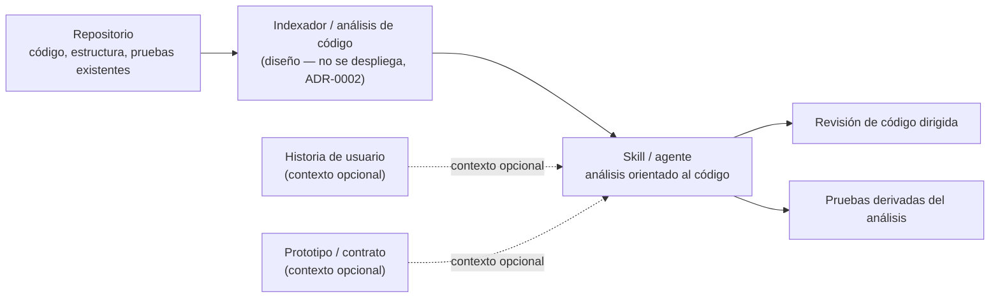

# Diagrama — arquitectura de alto nivel (histórico, superado)

> **Superado por [ADR-0004](../decisiones/0004-flujo-orientado-a-hus-generacion-de-codigo-y-autorrevision.md)**:
> este diagrama trataba las HUs como contexto secundario del análisis de código. El flujo real acordado
> es el opuesto — la HU es la entrada primaria que dispara todo el pipeline. Ver
> [`01-flujo-pipeline-hu-a-desarrollo.md`](01-flujo-pipeline-hu-a-desarrollo.md) y
> [`02-skill-orquestador-y-skills-por-fase.md`](02-skill-orquestador-y-skills-por-fase.md) para las
> versiones vigentes. Se conserva este archivo como registro histórico del razonamiento previo.

Versión editable (Mermaid) del diagrama de la propuesta, actualizada con los ajustes de alcance de
[ADR-0002](../decisiones/0002-alcance-de-infraestructura-diseno-no-despliegue.md) (infraestructura de
indexación: diseño, no despliegue) y
[ADR-0003](../decisiones/0003-codigo-como-eje-principal-hus-prototipos-como-contexto-secundario.md)
(código como eje principal, HUs/prototipos como contexto secundario opcional — líneas punteadas).
Refleja el diseño conceptual, no una decisión de implementación final — los componentes concretos
(framework de agentes, mecanismo de indexación, etc.) se definen vía ADRs en
[`../decisiones/`](../decisiones/) y este diagrama se actualiza conforme eso avanza.

## Notas

- El código es el eje principal: el skill analiza diff, estructura y pruebas existentes por sí solo.
  Las HUs y prototipos (líneas punteadas) enriquecen ese análisis cuando están disponibles, pero el
  sistema no depende de ellos para funcionar — ver ADR-0003.
- El indexador se documenta a nivel de diseño; no se despliega ni se opera como infraestructura
  persistente — ver ADR-0002. La validación se hace ejecutando el skill de forma puntual contra
  repositorios de prueba.
- Pendiente de un ADR: mecanismo concreto para incorporar el contexto de HU/prototipo al análisis de
  código (heurística, embeddings, LLM directo, híbrido).
