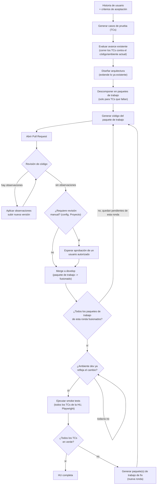

# Diagrama — flujo de una HU a través del pipeline

Flujo end-to-end por historia de usuario, según [ADR-0004](../decisiones/0004-flujo-orientado-a-hus-generacion-de-codigo-y-autorrevision.md),
extendido por [ADR-0007](../decisiones/0007-soporte-proyectos-con-avance-previo.md) (diagnóstico de
avance existente), [ADR-0015](../decisiones/0015-revision-manual-opcional-antes-de-merge.md) (revisión
manual opcional antes de merge) y [ADR-0020](../decisiones/0020-smoke-testing-corre-todos-los-tcs-como-regresion.md)/[ADR-0023](../decisiones/0023-smoke-testing-espera-a-toda-la-hu-no-por-subtarea.md)
(smoke testing corre todos los TCs de la HU, y espera a que toda una "ronda" de paquetes de trabajo esté
fusionada antes de correr — no se dispara por cada paquete de trabajo suelto).

## Notas

- `DIAG` es el paso de ADR-0007: los TCs que ya pasan contra el código/ambiente actual no generan
  paquete de trabajo en `SUB` — cubre tanto el caso greenfield (todos los TCs fallan, todos generan un
  paquete de trabajo) como el brownfield (solo los que faltan).
- El ciclo de revisión de código (`CR` ↔ `APLICA`) se repite hasta que un PR no tiene observaciones
  pendientes — solo entonces avanza a `MANUAL`.
- `MANUAL`/`ESPERA` son el paso de ADR-0015: si el Proyecto tiene `requiere_revision_manual`, el PR
  espera la aprobación de un usuario autorizado antes de fusionarse; si no, se fusiona directo.
- **`RONDA` es el gate de ADR-0023**: `SUB` (la descomposición inicial) y `FIXSUB` (cada tanda de
  fixes) producen una "ronda" de paquetes de trabajo. `SMOKE` no se dispara hasta que **todos** los
  paquetes de trabajo de la ronda en curso están fusionados — ni un paquete de trabajo suelto dispara
  smoke testing por sí solo, ni antes (trabajo original) ni después (fixes). Si una ronda de `FIXSUB`
  genera más de un paquete de trabajo de fix a la vez (varios TCs fallaron), `RONDA` espera a que todos
  esos fusionen antes de volver a correr `SMOKE`.
- `SMOKE` corre **todos los TCs de la HU** (ADR-0020), no solo los de la ronda recién fusionada — cada
  corrida es una prueba de regresión completa, versionada.
- **`DEPLOY` es el gate de ADR-0025**: fusionar no es lo mismo que desplegar. Antes de correr `SMOKE`,
  el orquestador verifica que el ambiente de desarrollo ya sirve el código recién fusionado — el
  mecanismo concreto (health-check, webhook, estado de CI/CD) es detalle de implementación, pero el
  chequeo en sí es obligatorio, no una espera arbitraria de tiempo fijo.
- Mientras el pipeline no llega a `SMOKE`, el avance por paquete de trabajo (PR abierto, en revisión, fusionado)
  ya es visible de forma continua a través de la plataforma (ADR-0012) — `RONDA` retrasa la
  *validación*, no la *visibilidad*.
- Pendiente de ADR: qué hacer con TCs de `DIAG` que dependen de un paquete de trabajo todavía no hecho
  (ver "pendiente" en ADR-0007) — sigue siendo un caso distinto al de `RONDA`, porque ocurre antes de
  que exista ningún paquete de trabajo.
- Este diagrama muestra el camino de una **HU** (elemento con criterios de aceptación). Un elemento
  clasificado como **Actividad** (ADR-0026) sigue un camino más corto: `ARQ` → `SUB` → `DEV` → `PR` →
  `CR` → `MANUAL`/`MERGE`, sin pasar por `TC`, `DIAG`, `RONDA`, `DEPLOY` ni `SMOKE` — al fusionarse
  queda completa directo, porque no tiene TCs que validar.
