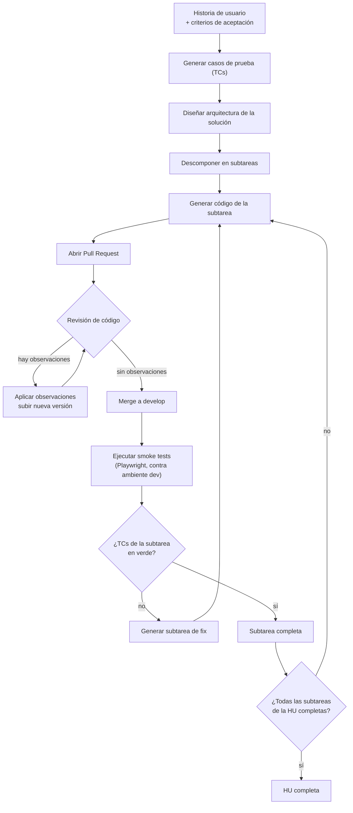

# Diagrama — flujo de una HU a través del pipeline

Flujo end-to-end por historia de usuario, según [ADR-0004](../decisiones/0004-flujo-orientado-a-hus-generacion-de-codigo-y-autorrevision.md).
Incluye los dos ciclos del sistema: revisión de código (hasta que un PR queda limpio) y smoke testing
(hasta que los TCs de la subtarea pasan).

## Notas

- El ciclo de revisión de código (`CR` ↔ `APLICA`) se repite hasta que un PR no tiene observaciones
  pendientes — solo entonces avanza a `MERGE`.
- El ciclo de smoke testing (`RESULT` → `FIXSUB` → `DEV`) genera una subtarea de fix nueva, que
  atraviesa de nuevo generación de código, PR y revisión — no se edita directamente el código ya
  fusionado.
- `ALL` es el criterio de cierre de la HU: todas sus subtareas con PR fusionado y smoke tests en verde.
- Pendiente de ADR: cómo se decide qué subconjunto de TCs vuelve a correr tras un fix (¿solo los que
  fallaron, o todos los de la subtarea?).
