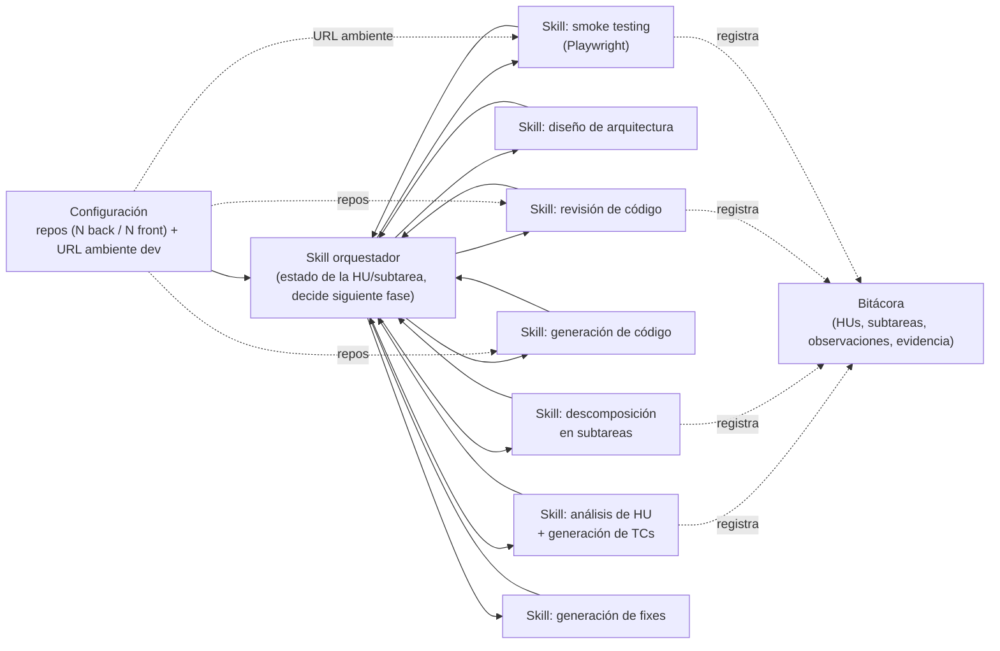

# Diagrama — skill orquestador y skills por fase

Componentes según [ADR-0004](../decisiones/0004-flujo-orientado-a-hus-generacion-de-codigo-y-autorrevision.md):
un skill orquestador que sabe en qué fase está cada HU/subtarea y despacha al skill especializado de esa
fase. La configuración de repos y ambiente ([ADR-0005](../decisiones/0005-solucion-configurable-repositorios-y-ambiente-dev.md))
alimenta a los skills que tocan código o el ambiente de desarrollo.

## Notas

- El orquestador es el único componente con visión del estado global de una HU; los skills de fase no
  se llaman entre sí directamente, siempre a través del orquestador — esto es lo que le permite
  "reaccionar según la fase en la que va".
- `S7` (generación de fixes) reutiliza `S4` (generación de código) y vuelve a pasar por `S5`; se
  dibujan separados porque el disparador es distinto (un TC fallido vs. una subtarea nueva de la HU).
- Pendiente de ADR: qué framework de agentes implementa esto (Claude Code Skills u otra alternativa) —
  sigue abierto desde `00-vision-general.md`.
