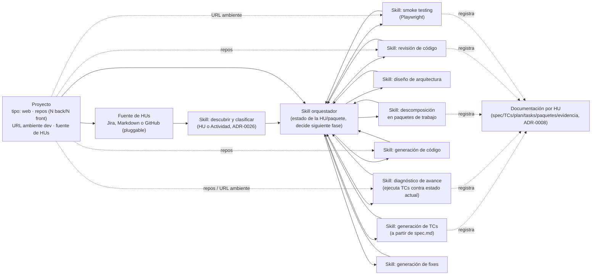

# Diagrama — skill orquestador y skills por fase

Componentes según [ADR-0004](../decisiones/0004-flujo-orientado-a-hus-generacion-de-codigo-y-autorrevision.md),
[ADR-0007](../decisiones/0007-soporte-proyectos-con-avance-previo.md),
[ADR-0009](../decisiones/0009-proyecto-como-entidad-de-configuracion-y-fuente-de-hus-pluggable.md) y
[ADR-0010](../decisiones/0010-agregar-github-como-fuente-de-hus.md): un skill orquestador que sabe en
qué fase está cada HU/paquete de trabajo y despacha al skill especializado de esa fase (vocabulario de
[ADR-0026](../decisiones/0026-vocabulario-unificado-hu-actividad-paquete-de-trabajo.md)). La
configuración de **Proyecto** (tipo, repos/ambiente, fuente de HUs) alimenta al descubrimiento de HUs y
a los skills que tocan código o el ambiente de desarrollo.

## Notas

- `S0` (ver [skills/01-descubrimiento-y-especificacion-hu.md](../skills/01-descubrimiento-y-especificacion-hu.md))
  descubre elementos del backlog de la fuente configurada, actúa como analista de requerimientos, y
  **clasifica cada uno como HU o Actividad** (ADR-0026) al producir `spec.md` — no es solo un lector, ya
  incluye el análisis. El adaptador concreto (Jira, Markdown, GitHub — ADR-0010) es intercambiable
  detrás de `FUENTE`. `S1` parte de ese `spec.md` ya analizado, no de la fuente cruda, y solo aplica a
  elementos clasificados como HU (una Actividad no genera TCs, ADR-0026).
- El orquestador es el único componente con visión del estado global de una HU; los skills de fase no
  se llaman entre sí directamente, siempre a través del orquestador — esto es lo que le permite
  "reaccionar según la fase en la que va".
- `S1B` (diagnóstico de avance, ADR-0007) y `S6` (smoke testing, ADR-0006) son **el mismo mecanismo de
  ejecución de TCs**, invocado en dos momentos distintos del flujo — conviene que compartan
  implementación en vez de duplicarse.
- `S7` (generación de fixes) reutiliza `S4` (generación de código) y vuelve a pasar por `S5`; se
  dibujan separados porque el disparador es distinto (un TC fallido vs. un paquete de trabajo nuevo de
  la HU).
- Pendiente de ADR: qué framework de agentes implementa esto (Claude Code Skills u otra alternativa) —
  sigue abierto desde `00-vision-general.md`.
