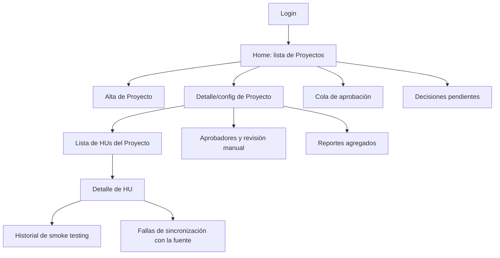

# Pantallas y módulos — Plataforma Telar

> Detalle de UI a partir de la [especificación de la plataforma](especificacion-plataforma-telar.md):
> qué pantallas existen, qué actor las usa, qué muestran/permiten y a qué requisito (RF) responden.
> Sigue el stack de [ADR-0031](decisiones/0031-stack-tecnologico-de-la-plataforma-loom.md) (frontend
> Angular) — aquí se perfila la estructura de pantallas/módulos, no el detalle visual ni componentes.

## 1. Mapa de navegación

Los módulos con permisos de configuración (alta/edición de Proyecto, aprobadores) solo son visibles
para el Administrador de Proyecto; Aprobador ve además "Cola de aprobación"; Observador solo ve las
pantallas de solo lectura (lista/detalle de HU, reportes).

## 2. Módulos Angular propuestos (lazy-loaded)

| Módulo | Pantallas que agrupa |
|---|---|
| `auth` | Login |
| `proyectos` | Home (lista), alta de Proyecto, detalle/config de Proyecto |
| `hus` | Lista de HUs, detalle de HU, historial de smoke testing |
| `aprobaciones` | Aprobadores y revisión manual (config), cola de aprobación |
| `reportes` | Reportes agregados |
| `decisiones-pendientes` | Decisiones pendientes, fallas de sincronización |

## 3. Pantallas

### 3.1 Login

- **Actor:** todos (RF-00).
- **Contenido:** formulario de autenticación. Mecanismo concreto (proveedor propio, OAuth, SSO) sigue
  pendiente (ADR-0031) — la pantalla es agnóstica del mecanismo final.
- **Tras login exitoso:** redirige a Home.

### 3.2 Home — lista de Proyectos

- **Actor:** todos los roles autenticados (RF-00c).
- **Contenido:** tabla de Proyectos accesibles al usuario, con nombre, tipo, modo de arranque y un
  indicador de si tiene decisiones pendientes o aprobaciones esperando (badge, ver 3.9/3.10).
- **Acciones:** Administrador ve botón "Nuevo Proyecto" (RF-01); cualquier rol puede entrar al detalle
  de un Proyecto (según su permiso).

### 3.3 Alta de Proyecto

- **Actor:** Administrador de Proyecto (RF-01 a RF-06).
- **Contenido:** formulario por secciones (no necesariamente wizard de varios pasos, puede ser un
  formulario con acordeones):
  1. **General**: nombre, tipo (`web`), modo de arranque (`nuevo`/`con_arquitectura`/`avanzado`).
  2. **Repositorios**: N repos objetivo (tipo, URL, rama base — RF-02), URL del ambiente de
     desarrollo (RF-03). El repositorio de control ya no se declara aquí — es una carpeta local
     estática que Loom gestiona por su cuenta (ADR-0035).
  3. **Cuenta de desarrollo**: referencia al secreto gestionado aparte, nunca la credencial en texto
     plano (RF-05, RNF-02).
  4. **Arquitectura base** (solo si modo `con_arquitectura`): referencia al `plan.md` existente
     (RF-06).
  5. **Fuente de HUs**: ver 3.4 — puede ir integrada aquí o diferirse a la pantalla de detalle.
- **Ayuda visual:** cada campo lleva un tooltip explicando qué es y de dónde sale. Junto al campo de cuenta de
  desarrollo, un panel plegable "¿Cómo doy de alta esta cuenta?" con los pasos concretos para generar
  el PAT de grano fino (ADR-0032) — la plataforma no genera el secreto por el usuario, solo lo guía.
- **Acciones:** Guardar (crea el Proyecto); Cancelar.

### 3.4 Detalle / configuración de Proyecto

- **Actor:** Administrador de Proyecto (edición, RF-07); Observador y Aprobador (solo lectura de los
  datos generales).
- **Contenido:** las mismas secciones del alta (3.3), editables, más:
  - **Fuente de HUs** (RF-08, RF-09): tipo (`jira`/`markdown`/`github`) y sus parámetros; para
    `github`, selector de resolución de jerarquía (sub-issues vs. labels/milestones).
  - **Cuentas de prueba** (RF-10): una entrada por rol de la aplicación evaluada, cada una como
    referencia a un secreto.
  - **Revisión manual** (RF-11): toggle `requiere_revision_manual` — accesos directos a la pantalla
    de aprobadores (3.9) cuando está activo.
- **Navegación:** desde aquí se accede a "Lista de HUs" (3.5), "Reportes" (3.8) y "Aprobadores" (3.9)
  de este Proyecto.

### 3.5 Lista de HUs del Proyecto

- **Actor:** todos los roles con acceso al Proyecto (RF-14).
- **Contenido:** tabla de HUs/Actividades con `id`, título, `fase`/`estado` actual, y si tiene
  decisiones pendientes (RF-19/20) o sincronización fallida (RF-21) — como indicador visual.
- **Filtros:** por fase, por estado, por si requiere atención.

### 3.6 Detalle de HU

- **Actor:** todos los roles con acceso al Proyecto (RF-14, RF-15).
- **Contenido:**
  - **Timeline de fases**: transiciones leídas del front-matter SDD y de `git log` del repo de
    control (RF-14) — solo lectura, la plataforma nunca dispara una fase desde aquí (RNF-01).
  - **Paquetes de trabajo**: tabla con `id`, repo, `estado` (`pendiente`/`en_revision`/`fusionado`/
    `completo`), `ronda`, y link al PR si existe (RF-15).
  - Acceso a "Historial de smoke testing" de esta HU (3.7).
  - Si la HU tiene un paquete "pendiente de definir" o quedó "fuera de alcance": banner con enlace a
    la pantalla de decisiones pendientes (3.10).

### 3.7 Historial de smoke testing (de una HU)

- **Actor:** todos los roles con acceso al Proyecto (RF-16).
- **Contenido:** lista de corridas (una por ronda que llegó a `DEPLOY`), cada una con qué TCs pasaron
  y cuáles fallaron, y su evidencia (ADR-0020) — sirve de historial de regresión.

### 3.8 Reportes agregados (por Proyecto)

- **Actor:** todos los roles con acceso al Proyecto (RF-17, RF-18).
- **Contenido:** las métricas del objetivo 11 (`00-vision-general.md`): tasa de TCs que cubren
  criterios de aceptación, proporción de criterios ya cubiertos en diagnóstico inicial, rondas de
  revisión de código hasta aprobación, tasa de éxito de smoke tests por iteración, y grado de
  generalización entre Proyectos/fuentes de HU. Filtro para distinguir trabajo de la cuenta de
  desarrollo de otros cambios en el mismo repo (RF-18).

### 3.9 Aprobadores y revisión manual

- **Actor:** Administrador de Proyecto (RF-12).
- **Contenido:** lista de `usuarios_autorizados_a_aprobar`; agregar/quitar personas. Visible/editable
  solo si `requiere_revision_manual` está activo para el Proyecto.

### 3.10 Cola de aprobación

- **Actor:** Aprobador autorizado (RF-13, RF-00b).
- **Contenido:** lista de PRs esperando aprobación en Proyectos donde el usuario autenticado está en
  `usuarios_autorizados_a_aprobar`. Cada entrada: HU, paquete de trabajo, link al PR, quién más ya
  aprobó si aplica.
- **Acciones:** aprobar (registra la identidad autenticada — RF-00b) o rechazar con comentario; el
  merge en sí lo ejecuta el orquestador (no esta pantalla, ver `skills/00-orquestador.md`).

### 3.11 Decisiones pendientes

- **Actor:** Administrador de Proyecto (RF-19, RF-20).
- **Contenido:** lista de HUs que requieren una decisión humana:
  - Paquete "pendiente de definir" por repo fuera de configuración (RF-19) — informativo, no bloquea
    el resto de la HU.
  - HU "fuera de alcance" (RF-20) — requiere elegir explícitamente **continuar** o **no continuar**.

### 3.12 Fallas de sincronización con la fuente

- **Actor:** Administrador de Proyecto (RF-21).
- **Contenido:** lista de paquetes de trabajo cuya creación en la fuente (Jira/GitHub vía MCP) falló,
  con el motivo y un botón **reintentar**. No bloquea el control interno del paquete mientras tanto.

## 4. Pendiente

- Mecanismo concreto de autenticación (ADR-0031) — determina el detalle final de la pantalla de Login.
- Si "Decisiones pendientes" y "Fallas de sincronización" se muestran como pantallas separadas o como
  una sola bandeja unificada de "cosas que requieren mi atención" — por ahora se documentan separadas
  porque responden a ADRs distintos (0022 y 0024), pero podrían converger en una sola vista.
