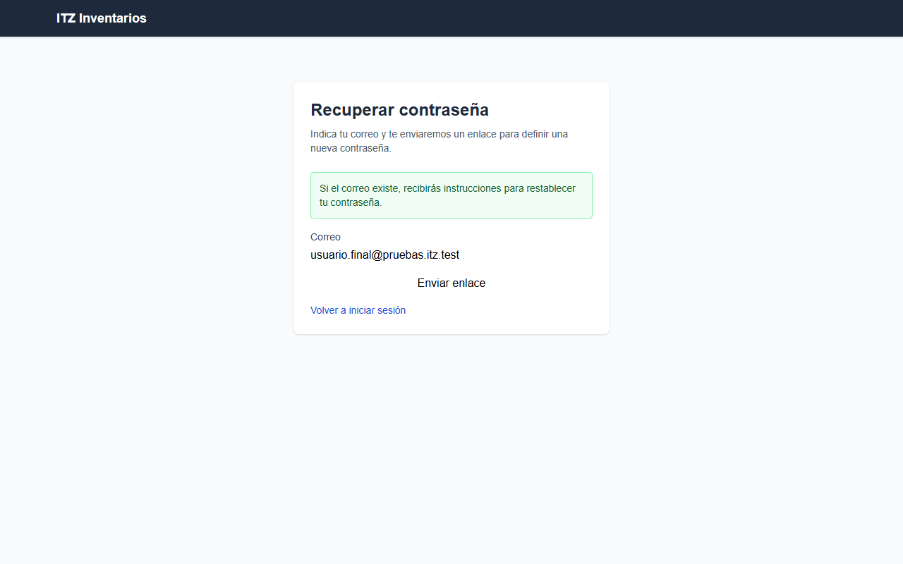
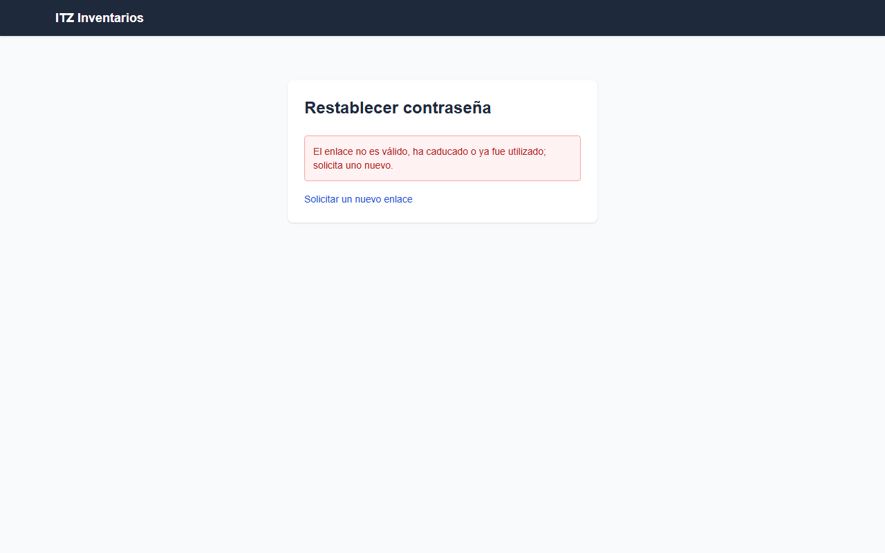
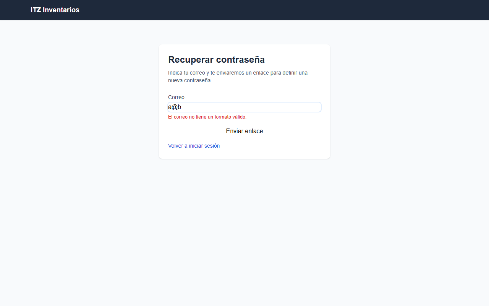
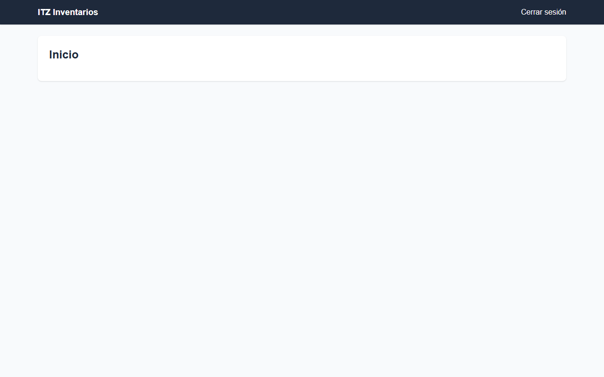
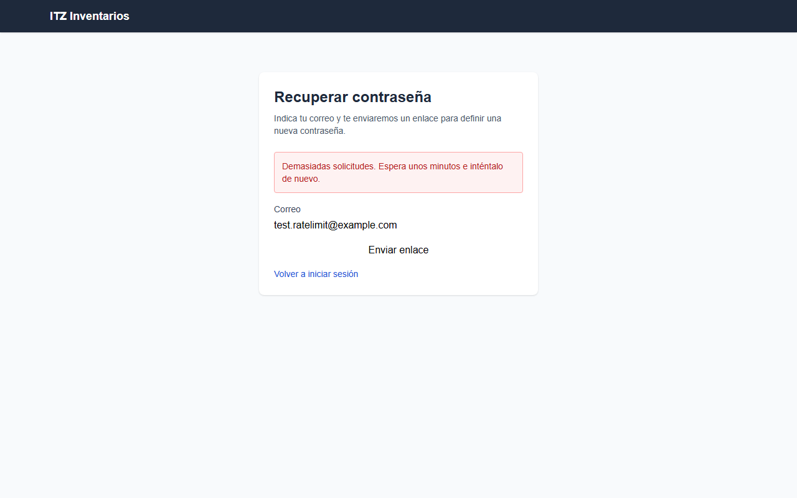
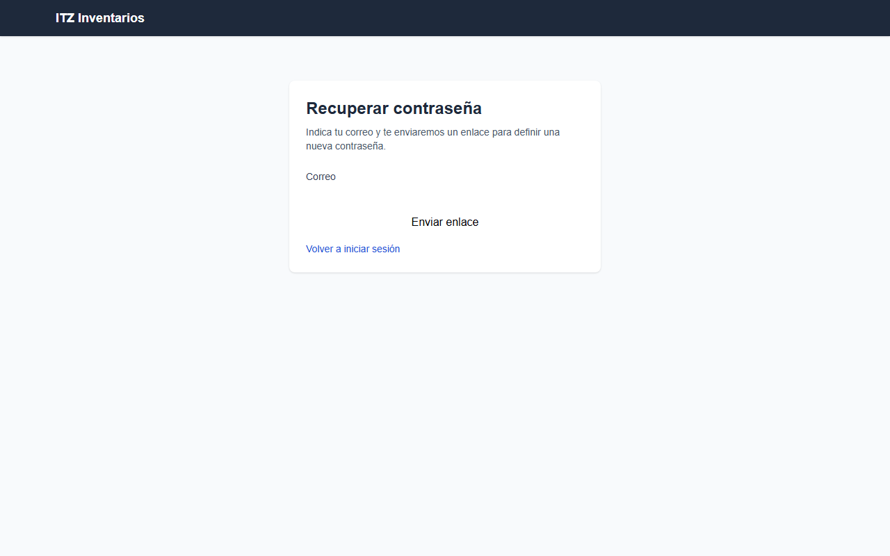

# Smoke testing — HU-002: Recuperar contraseña olvidada por correo electrónico

Corrida 1 (completo). Script de la HU: `smoke-01/HU-002_smoke.py`.

## Resumen

| Resultado | Casos | % |
|---|---:|---:|
| ✅ Pasa | 10 | 71% |
| ❌ Falla | 1 | 7% |
| ⛔ Bloqueado | 3 | 21% |
| **Total** | **14** | **100%** |

## Casos

| TC | Rol | Resultado | Cómo se resolvió | Motivo |
|---|---|---|---|---|
| TC-001 | usuario_final | ✅ Pasa | script |  |
| TC-002 | usuario_final | ✅ Pasa | script |  |
| TC-003 | invitado | ⛔ Bloqueado | agente (fallo confirmado) | Con un correo no registrado, la página muestra el mensaje genérico "Si el correo existe, recibirás instrucciones para restablecer tu contraseña." y no revela na |
| TC-004 | invitado | ✅ Pasa | script |  |
| TC-005 | usuario_final | ✅ Pasa | script |  |
| TC-006 | usuario_final | ✅ Pasa | script |  |
| TC-007 | usuario_final | ✅ Pasa | script |  |
| TC-008 | usuario_final | ✅ Pasa | script |  |
| TC-009 | usuario_final | ✅ Pasa | script |  |
| TC-010 | invitado | ✅ Pasa | agente (el script estaba mal) | Tras 5 envíos consecutivos para el mismo correo, la página mostró «Demasiadas solicitudes. Espera unos minutos e inténtalo de nuevo.», es decir, se aplica rate  |
| TC-011 | invitado | ✅ Pasa | script |  |
| TC-012 | invitado | ⛔ Bloqueado | agente (fallo confirmado) | El caso requiere un entorno con el servicio de correo configurado para fallar, una cuenta registrada y acceso a los logs del sistema. No hay cuenta de prueba (n |
| TC-013 | invitado | ⛔ Bloqueado | agente (fallo confirmado) | El caso exige cuentas de prueba bloqueada, inactiva y deshabilitada y acceso a sus buzones para confirmar que no se envía enlace. No se dispone de ninguna cuent |
| TC-014 | admin | ❌ Falla | agente (fallo confirmado) | Tras iniciar sesión como admin, la página de inicio solo muestra el encabezado "Inicio" y "Cerrar sesión", sin ninguna opción de "Auditoría". Al abrir /auditori |

## TC-001 — ✅ Pasa

## TC-002 — ✅ Pasa

## TC-003 — ⛔ Bloqueado

Con un correo no registrado, la página muestra el mensaje genérico "Si el correo existe, recibirás instrucciones para restablecer tu contraseña." y no revela nada más. No pude ejecutar la comparación: el caso indica que no hay cuenta de prueba, así que no tengo un correo registrado para repetir la solicitud. Tampoco puedo revisar los correos recibidos. Sin esa comparación no se puede confirmar que ambos mensajes, redirecciones y estados HTTP sean idénticos. · Script: AssertionError: Locator expected to be visible Actual value: None Error: element(s) not found Call log:

Verificación del agente de navegador:

1. ir a / — ok: abrió https://inventarios-web-118746543308.us-central1.run.app/
2. ir a /recuperar — ok: abrió https://inventarios-web-118746543308.us-central1.run.app/recuperar
3. clic link «¿Olvidaste tu contraseña?» — ok: clic
4. ir a /forgot-password — ok: abrió https://inventarios-web-118746543308.us-central1.run.app/forgot-password
5. escribir «noexiste.qa.test@example.com» en textbox «Correo» — ok: escribió «noexiste.qa.test@example.com»
6. clic button «Enviar enlace» — ok: clic
7. esperar texto «recibirás» — ok: apareció «recibirás»

## TC-004 — ✅ Pasa

## TC-005 — ✅ Pasa

## TC-006 — ✅ Pasa

## TC-007 — ✅ Pasa

## TC-008 — ✅ Pasa

## TC-009 — ✅ Pasa

## TC-010 — ✅ Pasa

Tras 5 envíos consecutivos para el mismo correo, la página mostró «Demasiadas solicitudes. Espera unos minutos e inténtalo de nuevo.», es decir, se aplica rate limiting. No se pudo verificar el buzón, la variante con distintos correos desde la misma IP ni la recuperación tras la ventana de espera.

Verificación del agente de navegador:

1. ir a / — ok: abrió https://inventarios-web-118746543308.us-central1.run.app/
2. ir a /login — ok: abrió https://inventarios-web-118746543308.us-central1.run.app/login
3. clic link «¿Olvidaste tu contraseña?» — ok: clic
4. ir a /forgot-password — ok: abrió https://inventarios-web-118746543308.us-central1.run.app/forgot-password
5. escribir «test.ratelimit@example.com» en textbox «Correo» — ok: escribió «test.ratelimit@example.com»
6. clic button «Enviar enlace» — ok: clic
7. clic button «Enviar enlace» — ok: clic
8. clic button «Enviar enlace» — ok: clic
9. clic button «Enviar enlace» — ok: clic
10. clic button «Enviar enlace» — ok: clic
11. verificar texto «Demasiadas solicitudes. Espera unos minutos e inténtalo de nuevo.» — ok: verificado: «Demasiadas solicitudes. Espera unos minutos e inténtalo de nuevo.» está visible

## TC-011 — ✅ Pasa

## TC-012 — ⛔ Bloqueado

El caso requiere un entorno con el servicio de correo configurado para fallar, una cuenta registrada y acceso a los logs del sistema. No hay cuenta de prueba (no hay correo registrado que usar) y desde la UI no se puede forzar el fallo del correo ni consultar logs. Solo se llegó a /forgot-password, con el formulario "Correo" y el botón "Enviar enlace". · Script: AssertionError: Locator expected to be visible Actual value: None Error: element(s) not found Call log:

Verificación del agente de navegador:

1. ir a / — ok: abrió https://inventarios-web-118746543308.us-central1.run.app/
2. esperar texto «contraseña» — ok: apareció «contraseña»
3. clic link «¿Olvidaste tu contraseña?» — ok: clic
4. clic link «¿Olvidaste tu contraseña?» — FALLÓ: Locator.click: Timeout 8000ms exceeded.

## TC-013 — ⛔ Bloqueado

El caso exige cuentas de prueba bloqueada, inactiva y deshabilitada y acceso a sus buzones para confirmar que no se envía enlace. No se dispone de ninguna cuenta ni buzón (cuenta de prueba: no). La página /forgot-password sí carga, con campo "Correo" y botón "Enviar enlace", pero no se puede ejecutar el escenario ni verificar el resultado esperado. · Script: El script generado no era válido (sintaxis inválida: expected '(' (línea 1)).

Verificación del agente de navegador:

1. ir a / — ok: abrió https://inventarios-web-118746543308.us-central1.run.app/
2. esperar texto «contraseña» — ok: apareció «contraseña»
3. clic link «¿Olvidaste tu contraseña?» — ok: clic
4. clic link «¿Olvidaste tu contraseña?» — FALLÓ: Locator.click: Timeout 8000ms exceeded.

## TC-014 — ❌ Falla

Tras iniciar sesión como admin, la página de inicio solo muestra el encabezado "Inicio" y "Cerrar sesión", sin ninguna opción de "Auditoría". Al abrir /auditoria, la app redirigió a /home. No hay registro de auditoría accesible para revisar las entradas de solicitud y restablecimiento, por lo que la funcionalidad no existe o no está disponible para el admin. · Script: El script generado no era válido (la IA no generó su función).

Verificación del agente de navegador:

1. ir a / — ok: abrió https://inventarios-web-118746543308.us-central1.run.app/
2. esperar texto «Iniciar sesión» — ok: apareció «Iniciar sesión»
3. escribir el usuario en «Correo» — ok: escribió el usuario de la cuenta de prueba
4. escribir el contrasena en «Contraseña» — ok: escribió el contrasena de la cuenta de prueba
5. clic button «Iniciar sesión» — ok: clic
6. esperar texto «Auditoría» — FALLÓ: Locator.wait_for: Timeout 8000ms exceeded.
7. verificar texto «Auditoría» — FALLÓ: Locator.wait_for: Timeout 5000ms exceeded.
8. ir a /auditoria — ok: abrió https://inventarios-web-118746543308.us-central1.run.app/auditoria

