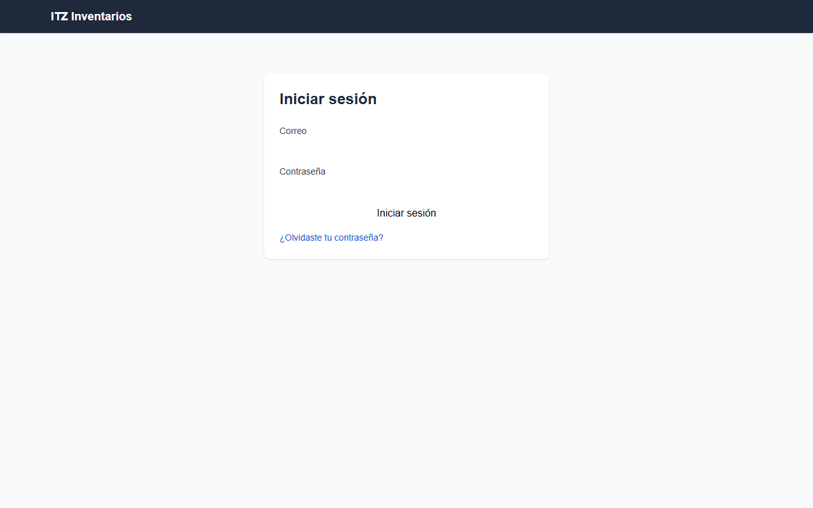
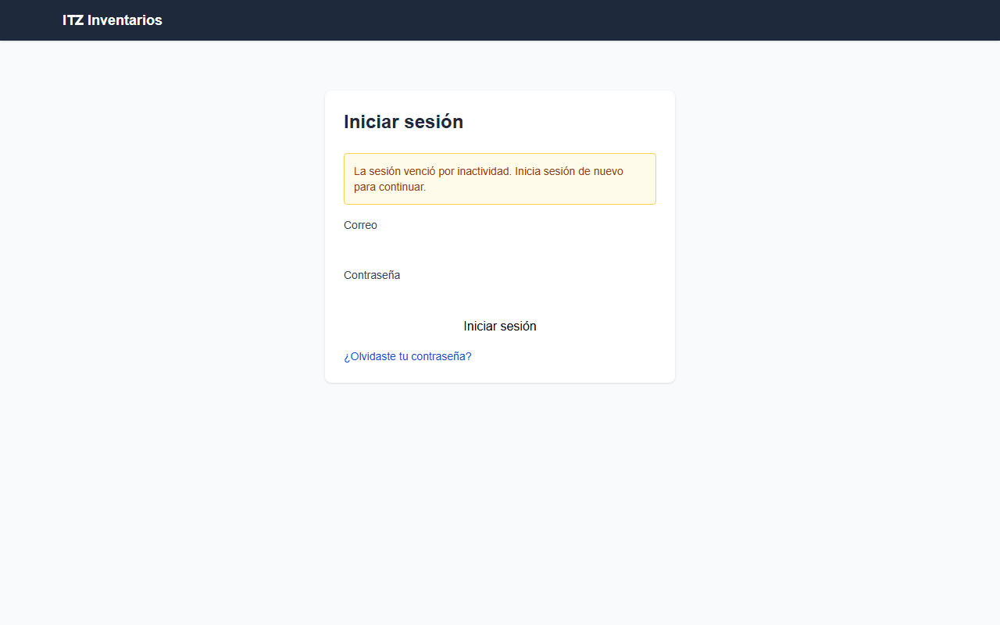
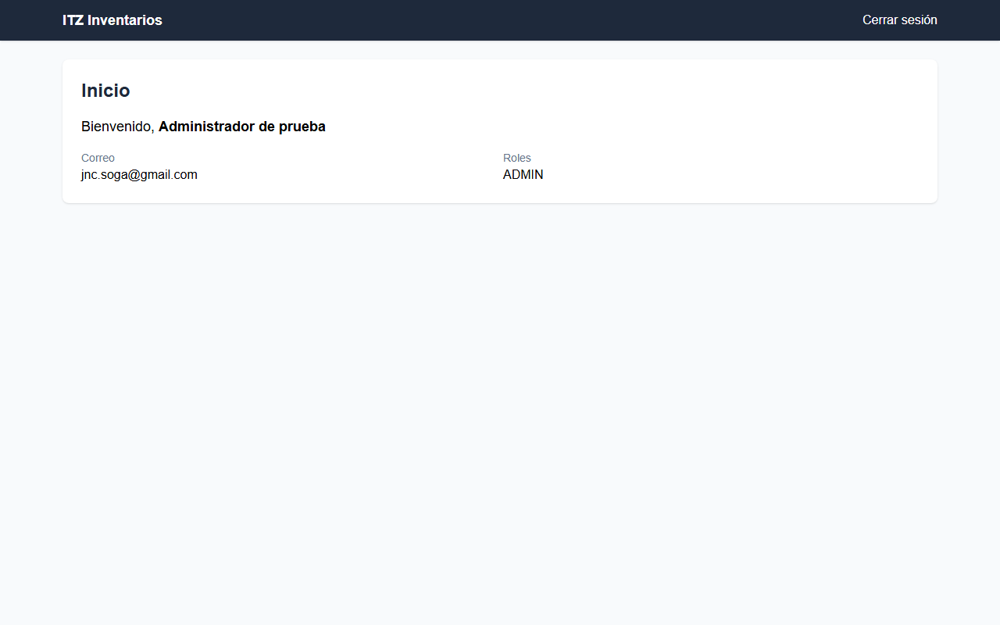

# Smoke testing — HU-003: Cerrar sesión manualmente y expirar sesión por inactividad

Corrida 1 (completo). Script de la HU: `smoke-01/HU-003_smoke.py`.

## Resumen

| Resultado | Casos | % |
|---|---:|---:|
| ✅ Pasa | 15 | 94% |
| ❌ Falla | 1 | 6% |
| ⛔ Bloqueado | 0 | 0% |
| **Total** | **16** | **100%** |

## Casos

| TC | Rol | Resultado | Cómo se resolvió | Motivo |
|---|---|---|---|---|
| TC-001 | usuario_final | ✅ Pasa | script |  |
| TC-002 | usuario_final | ✅ Pasa | script |  |
| TC-003 | usuario_final | ✅ Pasa | script |  |
| TC-004 | usuario_final | ✅ Pasa | script |  |
| TC-005 | usuario_final | ✅ Pasa | script |  |
| TC-006 | usuario_final | ✅ Pasa | script |  |
| TC-007 | usuario_final | ✅ Pasa | agente (el script estaba mal) | Tras cerrar sesión y pulsar atrás, la página permanece en /login mostrando «Iniciar sesión» y sin contenido protegido. |
| TC-008 | usuario_final | ✅ Pasa | script |  |
| TC-009 | usuario_final | ✅ Pasa | script |  |
| TC-010 | usuario_final | ✅ Pasa | script |  |
| TC-011 | usuario_final | ✅ Pasa | script |  |
| TC-012 | usuario_final | ✅ Pasa | script |  |
| TC-013 | usuario_final | ✅ Pasa | script |  |
| TC-014 | usuario_final | ✅ Pasa | script |  |
| TC-015 | usuario_final | ✅ Pasa | script |  |
| TC-016 | admin | ❌ Falla | agente (fallo confirmado) | Como admin, al abrir /bitacora la app redirige a /home, que solo muestra el encabezado "Inicio" y el botón "Cerrar sesión". No hay menú, enlace ni pantalla de b |

## TC-001 — ✅ Pasa

## TC-002 — ✅ Pasa

## TC-003 — ✅ Pasa

## TC-004 — ✅ Pasa

## TC-005 — ✅ Pasa

## TC-006 — ✅ Pasa

## TC-007 — ✅ Pasa

Tras cerrar sesión y pulsar atrás, la página permanece en /login mostrando «Iniciar sesión» y sin contenido protegido.

Verificación del agente de navegador:

1. ir a / — ok: abrió https://inventarios-web-118746543308.us-central1.run.app/
2. esperar texto «Iniciar sesión» — ok: apareció «Iniciar sesión»
3. escribir el usuario en «Correo» — ok: escribió el usuario de la cuenta de prueba
4. escribir el contrasena en «Contraseña» — ok: escribió el contrasena de la cuenta de prueba
5. clic button «Iniciar sesión» — ok: clic
6. esperar texto «Cerrar sesión» — ok: apareció «Cerrar sesión»
7. clic button «Cerrar sesión» — ok: clic
8. presionar «Alt+ArrowLeft» — ok: presionó Alt+ArrowLeft
9. verificar texto «Iniciar sesión» — ok: verificado: «Iniciar sesión» está visible

## TC-008 — ✅ Pasa

## TC-009 — ✅ Pasa

## TC-010 — ✅ Pasa

## TC-011 — ✅ Pasa

## TC-012 — ✅ Pasa

## TC-013 — ✅ Pasa

## TC-014 — ✅ Pasa

## TC-015 — ✅ Pasa

## TC-016 — ❌ Falla

Como admin, al abrir /bitacora la app redirige a /home, que solo muestra el encabezado "Inicio" y el botón "Cerrar sesión". No hay menú, enlace ni pantalla de bitácora/auditoría, así que no se puede ver el registro de cierre manual ni de expiración por inactividad. Se esperaba un registro por evento con usuario, fecha/hora y tipo. La funcionalidad no existe o no es accesible. · Script: AssertionError: Locator expected to be visible Actual value: None Error: element(s) not found Call log:

Verificación del agente de navegador:

1. ir a / — ok: abrió https://inventarios-web-118746543308.us-central1.run.app/
2. esperar texto «Iniciar sesión» — ok: apareció «Iniciar sesión»
3. escribir el usuario en «Correo» — ok: escribió el usuario de la cuenta de prueba
4. escribir el contrasena en textbox «Contraseña» — ok: escribió el contrasena de la cuenta de prueba
5. clic button «Iniciar sesión» — ok: clic
6. esperar texto «Cerrar sesión» — ok: apareció «Cerrar sesión»
7. ir a /bitacora — ok: abrió https://inventarios-web-118746543308.us-central1.run.app/bitacora

